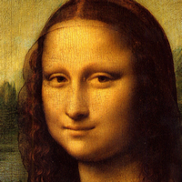
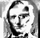
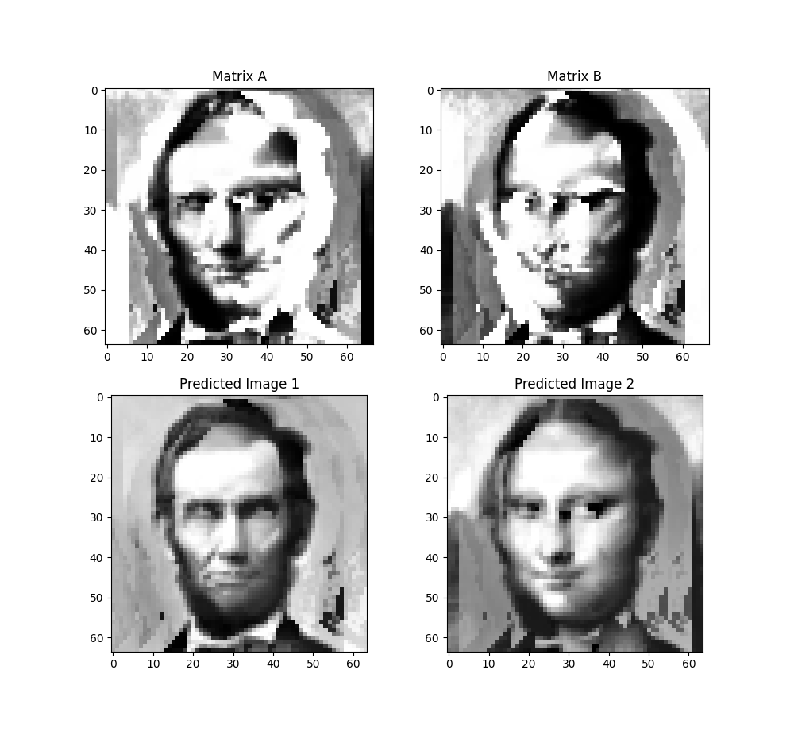
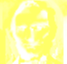
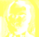
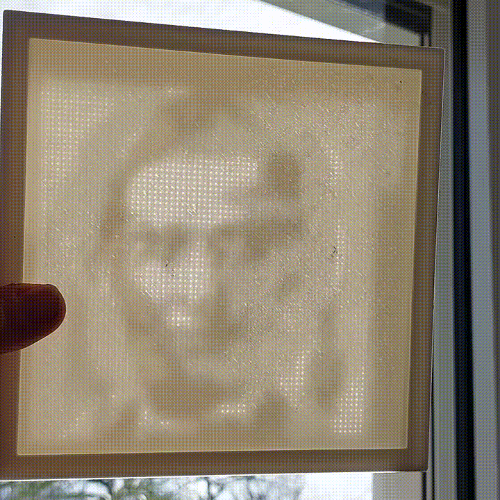

= Ombre double

== Optionally use virtual environment

[source,bash]
----
$> python -m venv .venv
$> source .venv/bin/activate
----

== install package

[source,bash]
----
$> python -m pip install .
----

== usage

[source,bash]
----
$> ombre_double -h
usage: ombre_double [-h] [--config CONFIG] [--print_config[=flags]] [--width WIDTH] [--height HEIGHT] [--shift SHIFT] [--iterations ITERATIONS] [--silent {true,false}] target_image1_path target_image2_path filter_image1_path filter_image2_path

positional arguments:
  target_image1_path    (required, type: str)
  target_image2_path    (required, type: str)
  filter_image1_path    (required, type: str)
  filter_image2_path    (required, type: str)

options:
  -h, --help            Show this help message and exit.
  --config CONFIG       Path to a configuration file.
  --print_config[=flags]
                        Print the configuration after applying all other arguments and exit. The optional flags customizes the output and are one or more keywords separated by comma. The supported flags are: comments, skip_default, skip_null.
  --width WIDTH         (type: int, default: 512)
  --height HEIGHT       (type: int, default: 512)
  --shift SHIFT         (type: int, default: 10)
  --iterations ITERATIONS
                        (type: int, default: 10000)
  --silent {true,false}
                        (type: bool, default: False)

----

== example

with input images :

[source,bash]
----
$> ombre_double samples/lincoln.png samples/mona.png  samples/lina1.png  samples/lina2.png --width 64 --height 64
training ━━━━━━━━━━━━━━━━━━━━━━━━━━━━━━━━━━━━━━━━ 100% 0:00:08
----

will generates:

and display the expected result:

Then follow https://github.com/jujumo/inkex_color_trace?tab=readme-ov-file#black-stripes-tutorial[black-stripes-tutorial]
to transform this into masks:

using OpenSCAD files link:samples/lina1.scad[lina1.scad] and link:samples/lina2.scad[lina2.scad]
you can regenerate both STL files link:samples/lina1.stl[lina1.stl] and link:samples/lina2.stl[lina2.stl].

And here is the real life experiment!

